# Fourdiff: A new way to resolve merge conflicts with ease and confidence

Hi, my name is Noam. I'm the original creator of [tqdm](https://github.com/tqdm/tqdm/commits/master/?author=noamraph), the Python progress bar library, so I can say that I have had at least one good idea. I want to share with you something that I have been using for the past 8 years: a new way to resolve merge conflicts (as well as cherry-pick and revert conflicts), that I call FourDiff.

A few years ago I was trying to resolve a particularly horrible merge conflict, and as a way to escape the horror, I started thinking: could there be a better way? A way that would let me really understand what I'm doing, instead of trying to guess my way out of the mess? Thank God, I found such a way, and I've been using it ever since. In fact, I can now barely resolve merge conflicts without it.

Here's a simple example. If you run this:

```bash
git clone https://github.com/noamraph/conflict-example.git
cd conflict-example
git merge origin/add-imports
```

You'll get this merge conflict (in `file.py`):

```python
import os
import sys
import json
<<<<<<< HEAD
=======
import random
import datetime
import math
import time
import collections
>>>>>>> origin/add-imports
import pathlib
import urllib
```

Seems easy enough. This is how it looks in VSCode:

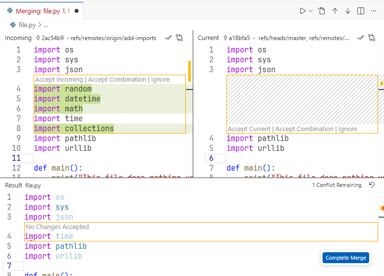

If you stop to think about it, there's something strange: why is `import time` not highlighted on the left? Anyway, I'm pretty sure I would have just taken all the imports and be done with it. However, that wouldn't be correct. Here's how it looks in what would hopefully be the next version of Meld:

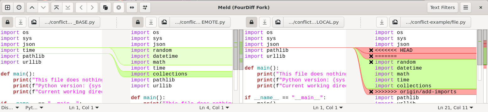

There are 4 panes. From left to right:

1. BASE
2. REMOTE
3. LOCAL
4. MERGED

LOCAL is your file before the merge. MERGED is the file you edit, where you want to resolve the conflict. Now, here's the crucial part: resolving the conflict **doesn't** mean to somehow combine REMOTE and LOCAL. What it **does** mean is to apply the change between BASE and REMOTE onto LOCAL. It helps me to look at it like adding vectors:

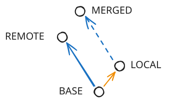

To get to MERGED, we need to add the blue vector, that takes us from BASE to REMOTE, to LOCAL.

We can write:

* MERGED = LOCAL + (REMOTE - BASE)

Or:

* MERGED - LOCAL = REMOTE - BASE

Anyway, from looking at the two left panes, it's clear what change we want to apply: add the imports for `random`, `datetime`, `math` and `collections`. But what actually is the source of this conflict? To see the source of the conflict, we can press Ctrl-T, or click the  button. The view switches to showing only the diff between the BASE and LOCAL panes. This diff is the orange vector, and it's not trivial to apply the change between BASE and REMOTE after it. Here's how it looks:

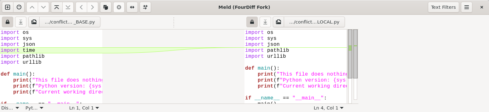

So we see that the change between BASE and LOCAL, which we want to preserve, is simply removing the `import time` line. Fortunately, the change we want to apply didn't touch `import time`, so we can press Ctrl-T again and edit the right pane to get this:

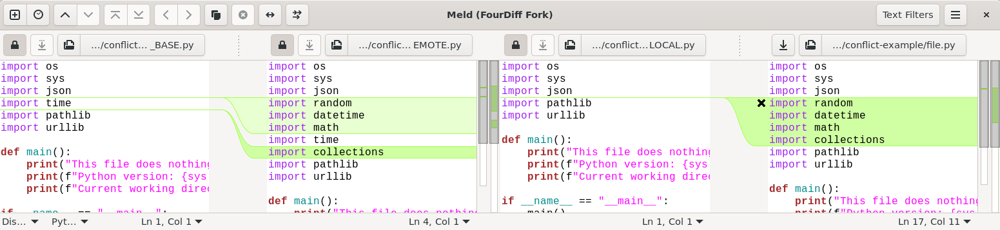

Now it's quite easy to see, visually, that between BASE and REMOTE we have the same diff as between LOCAL and MERGED. So we're done!

One more thing: Another way to get to MERGED is by adding the diff between BASE and LOCAL onto REMOTE, rather than add the diff between BASE and REMOTE onto LOCAL. Visually:

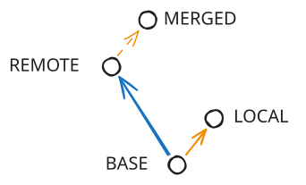

In some cases it can be much easier to apply this other change. To get this, click the  button ("swap REMOTE and LOCAL"), and you'll get:

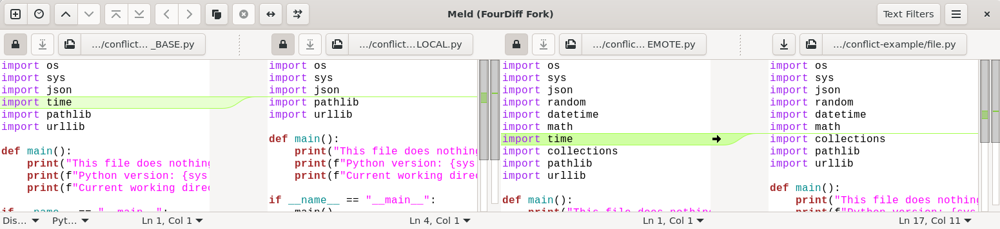

All this did was swap between the two middle panes. The MERGED pane is exactly the same. And now it's even simpler to see that we applied the diff correctly: in both cases, the change is simply to delete the `import time` line.

## A more complex example

<details>
<summary>
If you'd like to see a more complex merge conflict example I ran into at work, click here.
</summary>
<hr/>

Here's a real world example. I just changed some names to avoid giving away state secrets. You can get it by merging a different branch in the same `conflict-example` repository:

```bash
git clone https://github.com/noamraph/conflict-example.git
cd conflict-example
git merge origin/test-add-env
```

Here's how it looks in vscode:

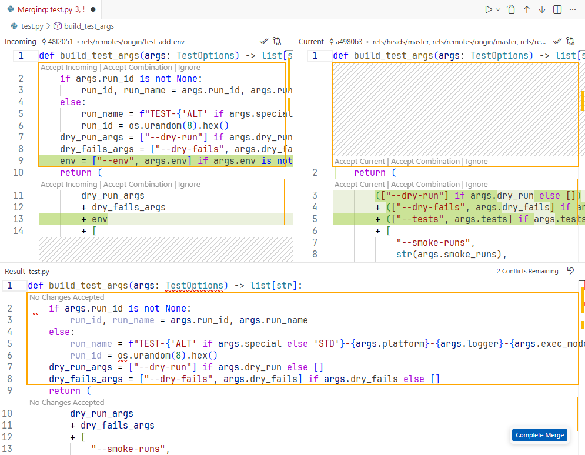

Good luck with that!

Here's how it looks after you run `git mergetool`, if you configured FourDiff as your default git merge tool:

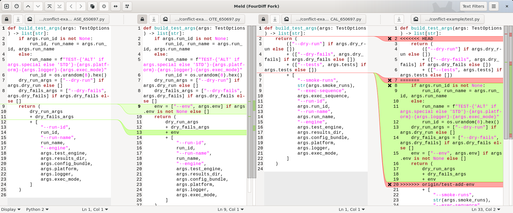

We see that the change we want to apply (between BASE and REMOTE) is just the addition of arguments after `dry_fails_args`. It's adding `env`, which is:

```python
env = ["--env", args.env] if args.env is not None else []
```

Now we can press Ctrl-T, and see the difference between BASE and LOCAL, which caused the conflict:

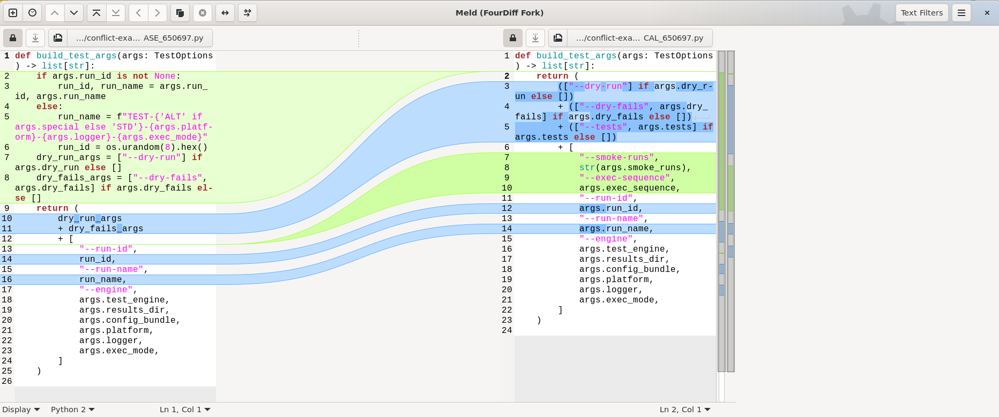

We see that the function actually got shorter. We can see that the changes are:
1. Instead of first defining `dry_run_args` and `dry_fails_args` and referencing it, it was decided to put the expressions directly in the `return` statement.
2. Two new argument parts were added, `--smoke-runs` and `--exec-sequence`.
3. `run_id` and `run_name` are now given in `args` instead of computed in the function.

Now it's quite easy to apply the change: We should just add the `--env` arguments. Let's add them after `--dry-fails`, like in the original change. We get:

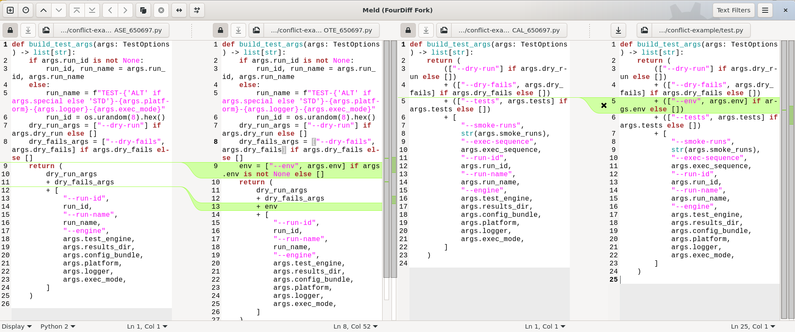

What I like in this view is that it lets me see in one picture how I applied the change on top of the modified code, and I can review it and gain confidence that the resolution makes sense.

</details>

## Installation


To try it on Ubuntu (including WSL), install [uv](https://docs.astral.sh/uv/getting-started/installation/), some packages required to build [pygobject](https://pygobject.gnome.org/getting_started.html#ubuntu-getting-started), and `meld-fourdiff`:
```bash
curl -LsSf https://astral.sh/uv/install.sh | sh
sudo apt update && sudo apt install -y --no-install-recommends libgirepository1.0-dev gcc libcairo2-dev pkg-config gir1.2-gtk-3.0 gir1.2-gtksource-4
uv tool install --python 3.10 meld-fourdiff
```
Make sure that `meld-fourdiff` works properly, by running `meld-fourdiff` and making sure you see a window, and add this section to your `~/.gitconfig`:

```ini
[mergetool "fourdiff"]
    cmd = meld-fourdiff "$BASE" "$REMOTE" "$LOCAL" "$MERGED"
```


I want to share with you a hack I made about two years ago, which I'm using to resolve merge conflicts (and cherry-pick conflicts, and revert conflicts) in my job. Before I discovered this idea, I have hated merges, I never understood what was going on. Now I resolve conflicts with confidence. It's actually really hard for me to use any other tool.

It looks like this. After running `git merge` and getting merge conflicts, I run `git mergetool` and see this (except for the arrows):
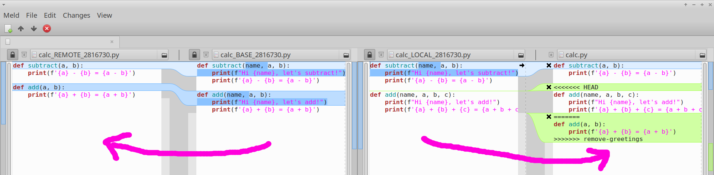
In every merge, the goal is to take the difference between two revisions (the "base revision" and the "remote revision") and apply it to the current revision (the "local revision"). From left to right we see: 1. the remote revision 2. the base revision 3. the local revision (without any changes applied) and 4. the merged revision, which is what we have in our working directory.

The first lines show a successful merge. We can see that the change between BASE and REMOTE is the same change between LOCAL and merged. Namely, the change is to remove the `name` argument and remove the `print()` line. I can visually verify that the changes along the left arrow look the same as the changes along the right arrow.

Then, we have a merge conflict. Git doesn't know how to apply the change, and leaves the job to us. The right pane shows the git merge conflict format. To find the conflicts, click the right pane, press Ctrl-F, and search for `<<<`.

To better understand what's going on, I can press Ctrl-T, and the view switches to show the difference between BASE and LOCAL. This difference is the cause of the merge conflict:
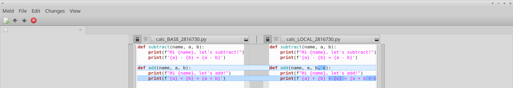

We see that the change between BASE and LOCAL is that we added another argument to the function, so it now adds 3 numbers instead of 2 (Please excuse my stupid example). Now that I understand what causes the merge conflict, I can apply the change with confidence, by pressing again Ctrl-T to switch back to the original view, and editing the file on the right. I get this:
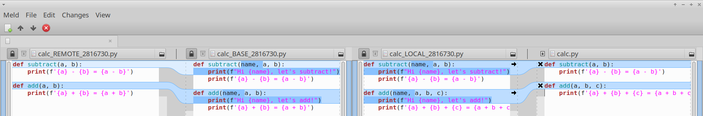

Again, I can visually verify that the change applied from LOCAL to MERGED looks the same as the change from BASE to REMOTE.

Perhaps it would help to show how the conflict looks with existing tools. If I run `git mergetool -t meld`, I get this:
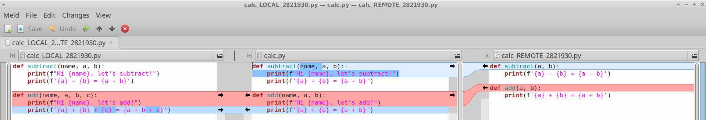

On one side we have the arguments `name, a, b, c` and a `print`. On the other side we have only `a, b` and no `print`. What should I take? The truth is that It's actually impossible to resolve the conflict using only LOCAL and REMOTE[^1].

## Installation
This is known to work on Ubuntu 20.04. You just need to clone my fork of `meld`, the excellent diff viewer, and configure git to use it to resolve merge conflicts.

Run this:

```bash
cd ~/
git clone -b fourdiff https://github.com/noamraph/meld.git
sudo apt install meld  # to install dependencies
```

And add this to `~/.gitconfig`:

```ini
[mergetool "fourdiff"]
    cmd = ~/meld/bin/meld "$REMOTE" "$BASE" "$LOCAL" "$MERGED"
[merge]
    tool = fourdiff
```

If you want to test it with the example I showed above, run this:

```bash
cd /tmp
git clone https://github.com/noamraph/conflict-example.git
cd conflict-example/
git merge origin/remove-greetings
```
You should get a merge conflict. Run this and the fourdiff should appear:
```bash
git mergetool
```
## Final thoughts

I find this to be a simple and very effective concept. I hope the `meld` developers would agree to add this feature, and I hope others will add it as well.

My initial thought was to arrange the panes in this order: BASE, REMOTE, LOCAL, MERGED. This would have made both the original change and the new change apply from left to right. However, this would have made the second view, showing the difference between BASE and LOCAL, confusing.

If you're a developer of a diff viewer and you want to add this to your app, the actual implementation is quite simple: there are always three 2-way diff widgets behind the scenes: BASE-REMOTE, REMOTE-LOCAL, LOCAL-MERGED. When one REMOTE is scrolled the other REMOTE is scrolled, and the same goes with LOCAL and LOCAL. This keeps all the panes in sync. The user can switch between showing BASE-REMOTE and LOCAL-MERGED, and showing only REMOTE-LOCAL.

[^1]: I could in theory compare the middle column to both sides, understand how it changed relative to both sides, and figure out how to apply both changes. But the visual diff doesn't help this at all, and after editing the middle there's no way to check this, and all this wouldn't work at all if you do a revert or a cherry-pick.
