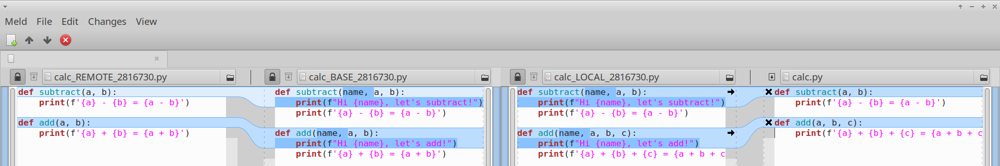

# fourdiff: I discovered how to resolve merge conflicts with confidence!
I want to share with you a hack I made about two years ago, which I'm using to resolve merge conflicts (and cherry-pick conflicts, and revert conflicts) in my job. Before I discovered this idea, I have hated merges, I never understood what was going on. Now I resolve conflicts with confidence. It's actually really hard for me to use any other tool.

It looks like this. After running `git merge` and getting merge conflicts, I run `git mergetool` and see this (except for the arrows):

In every merge, the goal is to take the difference between two revisions (the "base revision" and the "remote revision") and apply it to the current revision (the "local revision"). From left to right we see: 1. the remote revision 2. the base revision 3. the local revision (without any changes applied) and 4. the merged revision, which is what we have in our working directory.

The first lines show a successful merge. We can see that the change between BASE and REMOTE is the same change between LOCAL and merged. Namely, the change is to remove the `name` argument and remove the `print()` line. I can visually verify that the changes along the left arrow look the same as the changes along the right arrow.

Then, we have a merge conflict. Git doesn't know how to apply the change, and leaves the job to us. The right pane shows the git merge conflict format. To find the conflicts, click the right pane, press Ctrl-F, and search for `<<<`.

To better understand what's going on, I can press Ctrl-T, and the view switches to show the difference between BASE and LOCAL. This difference is the cause of the merge conflict:


We see that the change between BASE and LOCAL is that we added another argument to the function, so it now adds 3 numbers instead of 2 (Please excuse my stupid example). Now that I understand what causes the merge conflict, I can apply the change with confidence, by pressing again Ctrl-T to switch back to the original view, and editing the file on the right. I get this:


Again, I can visually verify that the change applied from LOCAL to MERGED looks the same as the change from BASE to REMOTE.

Perhaps it would help to show how the conflict looks with existing tools. If I run `git mergetool -t meld`, I get this:


On one side we have the arguments `name, a, b, c` and a `print`. On the other side we have only `a, b` and no `print`. What should I take? The truth is that It's actually impossible to resolve the conflict using only LOCAL and REMOTE[^1]. 

## Installation on local linux
This is known to work on Ubuntu 20.04. You just need to clone my fork of `meld`, the excellent diff viewer, and configure git to use it to resolve merge conflicts.

Run this:

```bash
cd ~/
git clone -b fourdiff https://github.com/noamraph/meld.git
sudo apt install meld  # to install dependencies
```

And add this to `~/.gitconfig`:

```ini
[mergetool "fourdiff"]
    cmd = ~/meld/bin/meld_git.py "$REMOTE" "$BASE" "$LOCAL" "$MERGED"
[merge]
    tool = fourdiff
```

## Installation using docker
After cloning, build a docker image:

```bash
docker build -t fourdiff .
```

And add this to `~/.gitconfig`:
```ini
[mergetool "fourdiff"]
    cmd = docker run --rm -it -v $(pwd):/workdir -v /tmp/.X11-unix:/tmp/.X11-unix -v $HOME/.config/fourdiff-dconf:/root/.config/dconf/ -e DISPLAY=$DISPLAY -h $HOSTNAME -v $XAUTHORITY:/root/.Xauthority fourdiff /root/meld/bin/meld_git.py "$REMOTE" "$BASE" "$LOCAL" "$MERGED"
[merge]
    tool = fourdiff
```


## Seeing it work

If you want to test it with the example I showed above, run this:

```bash
cd /tmp
git clone https://github.com/noamraph/conflict-example.git
cd conflict-example/
git merge origin/remove-greetings
```
You should get a merge conflict. Run this and the fourdiff should appear:
```bash
git mergetool
```
## Final thoughts

I find this to be a simple and very effective concept. I hope the `meld` developers would agree to add this feature, and I hope others will add it as well.

My initial thought was to arrange the panes in this order: BASE, REMOTE, LOCAL, MERGED. This would have made both the original change and the new change apply from left to right. However, this would have made the second view, showing the difference between BASE and LOCAL, confusing.

If you're a developer of a diff viewer and you want to add this to your app, the actual implementation is quite simple: there are always three 2-way diff widgets behind the scenes: BASE-REMOTE, REMOTE-LOCAL, LOCAL-MERGED. When one REMOTE is scrolled the other REMOTE is scrolled, and the same goes with LOCAL and LOCAL. This keeps all the panes in sync. The user can switch between showing BASE-REMOTE and LOCAL-MERGED, and showing only REMOTE-LOCAL.

[^1]: I could in theory compare the middle column to both sides, understand how it changed relative to both sides, and figure out how to apply both changes. But the visual diff doesn't help this at all, and after editing the middle there's no way to check this, and all this wouldn't work at all if you do a revert or a cherry-pick.

